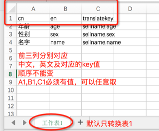

## i18njson  [](https://www.npmjs.org/package/i18njson)

国际化json生成器
将excel翻译文档转换成两个中英文js文件

> 用于将excel翻译文档转换成json文档，免得手动复制黏贴

### Installation

```
npm install i18njson -g
```

### Usage


1. 切换到工作目录

2. 运行命令 i18njson build filename

如
```
cd src/i18n

i18njson build text.xlsx
```

翻译文档格式及生成的中英文js可参考[mock](https://github.com/mosikoo/i18njson/tree/master/mock)中`test.xlsx`, `zh-cn.js`, `en.js`

### 翻译文档格式



* 前三列分别对应中文、英文、及转换的key值
* 只转换表1
* A1,B1,C1作为表头不翻译，可任意写值
